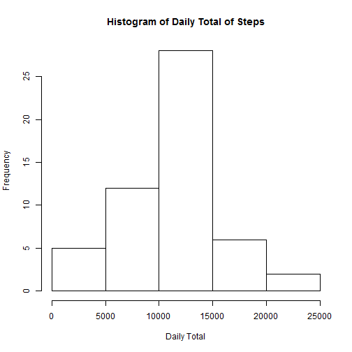
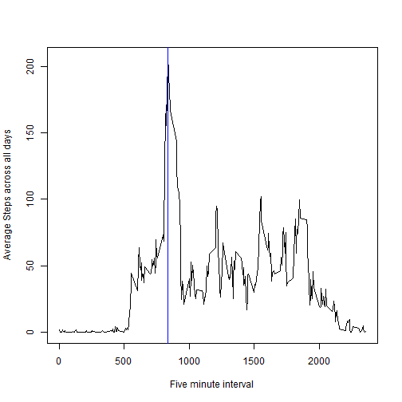
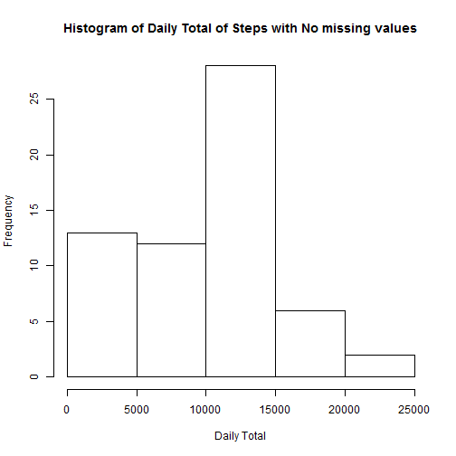
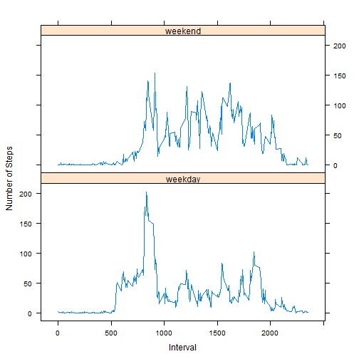

The data for this assignment will be downloaded from the internet
Dataset: Activity monitoring data 
The variables included in this dataset are:

- steps: Number of steps taking in a 5-minute interval (missing values are coded as NA)  
- date: The date on which the measurement was taken in YYYY-MM-DD format  
- interval: Identifier for the 5-minute interval in which measurement was taken  

##Loading the data


```r
library(plyr)
#================================================
#This function returns data required for plotting
#================================================ 
  #download data from URL
 
  dataFileURL <- "http://d396qusza40orc.cloudfront.net/repdata%2Fdata%2Factivity.zip"
  #https://d396qusza40orc.cloudfront.net/repdata%2Fdata%2Factivity.zip
  #I am using Windows so https is removed and replaced with http curl does not work in my machine
  if (!file.exists(".\\data")){dir.create(".\\data")}#if there is no directory called data create one
  #now store downloaded file in data directory
  download.file(dataFileURL, destfile = ".\\data\\data.zip", mode ="wb")
  #mode set to "wb" because this is binary data
  unzip (".\\data\\data.zip")
 				
  ### READING data  
  data <- read.csv("activity.csv", header = TRUE)
  ##      steps       date          interval
  ## 1    NA         2012-10-01        0
  ## 2    NA         2012-10-01        5
```
For the rest of the analysis we ignore missing data and calcualte steps for each day

```r
dateSteps <- data[, c(1,2)]# only take date and steps columns
NARemovedSteps <- dateSteps[complete.cases(dateSteps),] #remove all NAs
#using ddply summarise steps by date
DailyTotal <- ddply(NARemovedSteps, "date", summarise, sum = sum(steps))
```
Next we create a histogram of total number of steps

```r
hist(DailyTotal$sum, xlab = "Daily Total", ylab = "Frequency", main = "Histogram of Daily Total of Steps" )
```

 
### Mean steps per day

```r
mean(DailyTotal$sum)
```

```
## [1] 10766.19
```
### Median steps taken per day

```r
median (DailyTotal$sum)
```

```
## [1] 10765
```
## Average Daily activity pattern

```r
##      steps       date          interval
  ## 1    NA         2012-10-01        0
  ## 2    NA         2012-10-01        5
  NARemovedData <- data[complete.cases(data),]
  # now all NA s are removed from the data set
  
  #calculate average for each interval peroid across days
  intervalAvg <- ddply(NARemovedData, "interval", summarise, sum = mean(steps))
  
  # plot the time series of 5 min intervals
  with (intervalAvg,  plot(intervalAvg$interval,intervalAvg$sum, 
					type ="l", ylab = "Average Steps across all days", xlab ="Five minute interval"))
  maxAvg = max(intervalAvg$sum) #find maximum value
  maxrow <- subset(intervalAvg,sum == maxAvg)#find the row with max value 
  abline (v= maxrow[1,1], col = "blue" ) #draw vertical line to show the max value interval
```

 

```r
  maxrow[1,1]
```

```
## [1] 835
```
## Next task is to replace missing values with average for that day
Total number of missing values in the data set is calculated by:

```r
NARemovedData <- data[complete.cases(data),]
nrow(data) - nrow (NARemovedData)
```

```
## [1] 2304
```
Using the strategy create a new data set

```r
	NARemovedSteps <- dateSteps[complete.cases(data),] #remove all NAs
	DailyAvg <- ddply(NARemovedSteps, "date", summarise, avg = round(mean(steps)))#rounded value
	NoNAs <- data #[c(1,2, 17568, 16858),]
	newSteps <- numeric() #create empty vector of type numeric
	for (i in 1:nrow(NoNAs)){
	  if (is.na(NoNAs[i,c(1)]) ){ #c(1) is steps
	    calendarDate <- NoNAs[i,c(2)]#c(2) is date
		#this means the value is NA so we need to fill the value with mean
		value <- DailyAvg[DailyAvg$date == calendarDate,]
		steps = 0
		if (nrow(value) == 0){
		  steps = 0
		}
		else {
         steps = 	value[1,c(2)]
        }		 
		newSteps <- c(newSteps, steps )
			
	  }
	  else {
		#this element is not NA
		#so add that value to the vector newSteps
		newSteps <- c(newSteps,NoNAs[i, c(1)])
		#print("#")
	  }
	}
	#Now the newSteps have all the values for the missing values in them
	#drop the column steps from NoNAs and add the column newSteps
	
	NoNAs[,"steps1"] <- newSteps 
	NoNAs$steps <- NULL
	#change colunm name
	colnames(NoNAs)[3] <- "steps"
	#reorder columns to have # steps date interval
	x <- NoNAs[, c(3,1,2)]
```
Now using the new data set again make histogram and calculate mean and median.


```r
	dateSteps <- x[, c(1,2)]# only take date and steps columns
NARemovedSteps <- dateSteps[complete.cases(dateSteps),] #remove all NAs
#using ddply summarise steps by date
DailyTotalx <- ddply(NARemovedSteps, "date", summarise, sum = sum(steps))
	
	hist(DailyTotalx$sum, xlab = "Daily Total", ylab = "Frequency", main = "Histogram of Daily Total of Steps with No missing values" )
```

 
Calculate Mean


```r
	mean(DailyTotalx$sum)
```

```
## [1] 9354.23
```
Calculate Median

```r
		median(DailyTotalx$sum)
```

```
## [1] 10395
```
###Do the values differ

#### mean

```r
	if (mean(DailyTotalx$sum) == mean(DailyTotalx$sum))
	  print ("mean is the same")
```

```
## [1] "mean is the same"
```

```r
	if (mean(DailyTotalx$sum) != mean(DailyTotalx$sum))
    print ("mean differs")
```
#### median

```r
if (median(DailyTotalx$sum) == median(DailyTotal$sum))
	 print ("median is the same")

if (median(DailyTotalx$sum) != median(DailyTotal$sum))
	 print ("median differ")
```

```
## [1] "median differ"
```
This shows that there is a difference of Median but not the mean

## Activity patterns Weekdays and Weekends

To identify which day of the week I used weekdays() function. I wrote a function to be used with sapply() to find out whether a given day is a week day or weekend


```r
	day.type <- function (day){
	if (day == "Saturday" || day == "Sunday"){
		return ("weekend") #weekend
	}
	else{
		return ("weekday") #weekday
	}
}
```
By using sapply with the day.type function I wrote I created a vector to be added to the data set


```r
# data set that will be used is x
z <- sapply(weekdays(as.Date(x$date)), FUN = day.type )
#convert to factor variable and append it to the data set
NoNAs$day <-as.factor(z)
```
Now using lattice package I plot the weekday average and Weekend averages	

```r
library(lattice)
panelplot <- function (NoNAs) {
	#average the values 
	#calculate average for each interval peroid across weekdays and weekends
    avgSteps <- aggregate(NoNAs$steps, list(interval = as.numeric(NoNAs$interval), day = NoNAs$day), FUN=mean)
	xyplot (avgSteps$x ~ avgSteps$interval | as.factor(avgSteps$day), layout = c(1,2), type = "l", xlab = "Interval", ylab = "Number of Steps")
}

panelplot(NoNAs)
```

 
From the panel plots it can be seen that during the weekend people tend to be more active in the latter part of the day as opposed to weekdays where people are more active in the morning.
